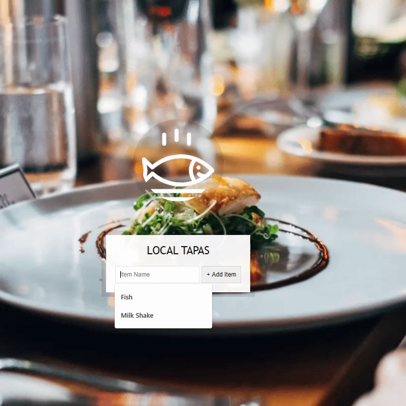

This is more like a todo app!
It's about restaurant dishes

## How To
This is how the app looks like-

## Tech I Used
This app is purely made with vanilla JavaScript & raw HTML/CSS. It is to demonstrate, if you can be creative you can make something amazing out of those core technologies.

Key topics-
+ **HTML:** I used custom data- attribute & form
+ **CSS:** I used Flexbox to position the image, transition to the effects key button.
+ **JS:** I used DOM manipulation technique, localStorage and event delegation
## Conclusion
+ This is project is part of javascript challenge by Wes Bos namely JavaScript30. Awesome Challenge! Couldn't recommend it more. https://javascript30.com/
